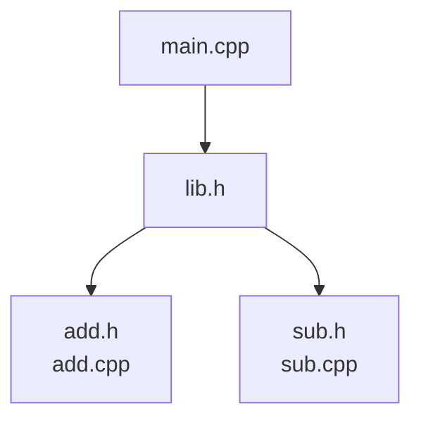

# Dependencies example

In this example, instead of specifying the files to be included in the Doxygen documentation using the `srcs` attribute with a glob, we use the `deps` attribute.
This allows us to select a target and immediately include all of the files in its `srcs`, `hdrs`, and `data` attributes, along with all of its transitive dependencies.

```bash
bazel build //dependencies:doxygen
```

## Showcase

In a very common scenario, imagine working on a C++ project with the following build file:

```bazel
# BUILD.bazel
load("@rules_cc//cc:defs.bzl", "cc_library")

cc_library(
    name = "add",
    srcs = ["add.cpp"],
    hdrs = ["add.h"],
)

cc_library(
    name = "sub",
    srcs = ["sub.cpp"],
    hdrs = ["sub.h"],
)

cc_library(
    name = "lib",
    hdrs = ["lib.h"],
    deps = [
        ":add",
        ":sub",
    ],
)

cc_library(
    name = "main",
    srcs = ["main.cpp"],
    deps = [":lib"],
)
```

The graph of dependencies looks like this:



If we want to include all of the files in the documentation, we can use the `deps` attribute to collect the `main` target's files and those of its transitive dependencies, like this:

```bazel
# BUILD.bazel
load("@doxygen//:doxygen.bzl", "doxygen")

doxygen(
    name = "doxygen",
    deps = [":main"],
    doxygen_config = ":Doxyfile",
)
```
